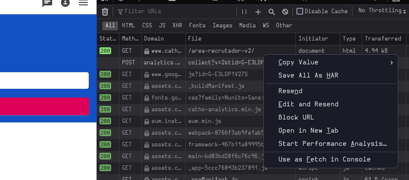

# Bot De Mensagens
## Setup
Clone esse repositório e rode um ambiente virtual.

Não é totalmente necessário, mas assim você evita de baixar bibliotecas inuteis:

```fish
python3 -m venv venv
```

Se conecte no ambiente virtual criado

No Powershell:
```powershell
.\venv\Scripts\Activate.ps1
```

No Linux/WSL:
```bash
source venv/bin/activate.csh
```

Baixe as bibliotecas que são utilizadas pelo bot com o seguinte comando:

```fish
pip3 install -r requirements.txt
```

## Passo-a-Passo
Para rodar o bot, primeiramente você precisa se conectar no site da catho e então salvar a requisição em um arquivo `.har` no local onde `message_bot.py` fica.
Basta logar no site, entrar nas **Ferramentas de Desenvolvedor**, normalmente pressionando as teclas `CTRL` + `SHIF` + `I`, clicar na aba de `Network` e então selecionar a requisição da página atual. (*Se não for possível achar a requisição, basta recarregar a página*):



Após salvar o arquivo na mesma pasta que `message_bot.py`, o código pode ser executado, basta rodar:

```fish
python3 ./message_bot.py
```

**_Não remova o arquivo `database.json` criado_**

## Diferenças

Essa versão do bot remete aos princípios do código, aonde reunia todos os números do site dentro do banco de dados.

Ainda inclui a remoção de duplicatas
